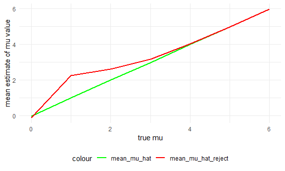

Homework 5
================

## Problem 1

**Read in the homicide dataset**

``` r
homicide_df = 
  read_csv("./data/homicide-data.csv") %>%
  mutate(
    city_state = str_c(city, state, sep = "_"),
    resolved = case_when(
      disposition == "Closed without arrest" ~ "unsolved",
      disposition == "Open/No arrest"        ~ "unsolved",
      disposition == "Closed by arrest"      ~ "solved",
    )
  ) %>% 
  select(city_state, resolved) %>% 
  filter(city_state != "Tulsa_AL")
```

The raw dataset shows us information on homicides in 50 U.S. cities; it
contains variables such as id, city/state and latitude and longitude for
the location of the murder, date of reported crime, and information
about the victim such as name, race, age, and sex.

We created a city\_state variable and are looking at each case based on
whether or not they are solved/unsolved.

**Looking at the dataset**

``` r
aggregate_df = 
  homicide_df %>% 
  group_by(city_state) %>% 
  summarize(
    hom_total = n(),
    hom_unsolved = sum(resolved == "unsolved")
  )
```

In this step we are summarizing to obtain number of unsolved and total
homicides in each city\_state.

**Proportion test for Baltimore, MD:**

``` r
prop.test(
  aggregate_df %>% filter(city_state == "Baltimore_MD") %>% pull(hom_unsolved), 
  aggregate_df %>% filter(city_state == "Baltimore_MD") %>% pull(hom_total)) %>% 
  broom::tidy()
## # A tibble: 1 x 8
##   estimate statistic  p.value parameter conf.low conf.high method    alternative
##      <dbl>     <dbl>    <dbl>     <int>    <dbl>     <dbl> <chr>     <chr>      
## 1    0.646      239. 6.46e-54         1    0.628     0.663 1-sample~ two.sided
```

**Iterate the proportion test for each city:**

``` r
results_df = 
  aggregate_df %>% 
  mutate(
    prop_tests = map2(.x = hom_unsolved, .y = hom_total, ~prop.test(x = .x, n = .y)),
    tidy_tests = map(.x = prop_tests, ~broom::tidy(.x))
  ) %>% 
  select(-prop_tests) %>% 
  unnest(tidy_tests) %>% 
  select(city_state, estimate, conf.low, conf.high)
```

**Plot:**

``` r
results_df %>% 
  mutate(city_state = fct_reorder(city_state, estimate)) %>% 
  ggplot(aes(x = city_state, y = estimate)) +
  geom_point() + 
  geom_errorbar(aes(ymin = conf.low, ymax = conf.high)) + 
  theme(axis.text.x = element_text(angle = 90, vjust = 0.5, hjust = 1))
```


## Problem 2

**Read in all datasets and create tidy dataframe**

``` r
path_df = 
  tibble(
    path = list.files("data/study")
  ) %>% 
  mutate(
    path = str_c("data/study/", path),
    data = map(.x = path, ~read_csv(.x)) # reading in datasets
  ) %>% 
  unnest(data) %>% 
  mutate(
    path = str_replace(path, "data/study/", ""),
    id = path,
    id = str_replace(id, ".csv", ""),
  ) %>% # pivot longer to tidy data
  pivot_longer(
    week_1:week_8,
    names_to = "week",
    values_to = "observation",
    names_prefix = "week_"
  ) %>% 
  mutate(
    week = as.numeric(week)
  ) %>% 
  select(-path)
```

**Create spaghetti plot and comment on group differences**

``` r
path_df %>% 
  ggplot(aes(x = week, y = observation, color = id)) +
  geom_line()
```



From the plot we can see that the control observation values are lower
than the experimental group’s observations. Although there are
variations between the different control subjects and experimental
subjects, overall control observations fall under values 3-4 and under
while experimental observations are mostly above 2.5.

## Problem 3
